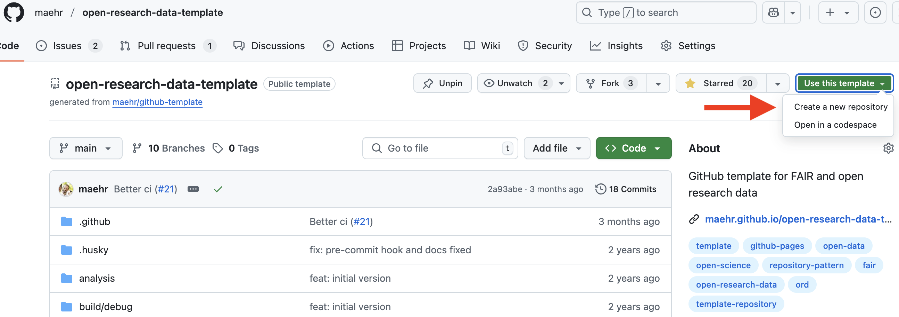
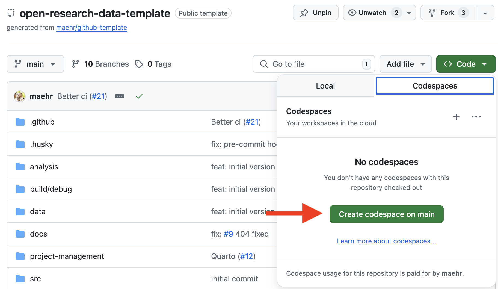
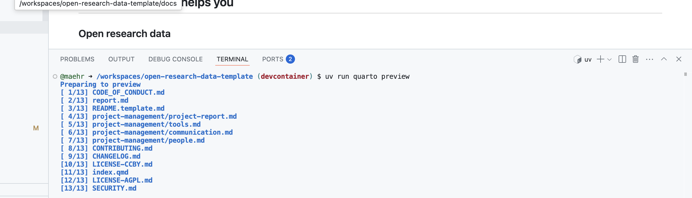

# GitHub template for FAIR and open research data

This GitHub template is independent of the (research) data and its format. It follows the best practices for open research data as outlined in [The Turing Way](https://the-turing-way.netlify.app/). It uses [GitHub Actions](https://docs.github.com/en/actions) to manage releases, issues, and pull requests, [GitHub Pages](https://pages.github.com/) for documentation, and [Zenodo](https://zenodo.org/) for long-term archiving.

[](https://github.com/maehr/open-research-data-template/issues)
[](https://github.com/maehr/open-research-data-template/network)
[](https://github.com/maehr/open-research-data-template/stargazers)
[](https://github.com/maehr/open-research-data-template/blob/main/LICENSE-AGPL.md)
[](https://github.com/maehr/open-research-data-template/blob/main/LICENSE-CCBY.md)
[](https://zenodo.org/badge/latestdoi/ZENODO_RECORD)

## Why use a template (even for small datasets)?

- Share your [open research data](#open-research-data) with others
- Write better [documentation](#documentation) for yourself and the community
- Write more [consistent](#consistency) code and encourage collaboration
- Increase [security](#security)
- Follow accepted [ethics](#ethics)

## How this template helps you

### Open research data

- Citeable via [DOI](https://www.doi.org/) (and [CITATION.cff](https://citation-file-format.github.io/))
- Automatic long-term archiving via [Zenodo](https://zenodo.org/)
- Licensed under a non-restrictive [AGPL 3.0](LICENSE-AGPL.md) and [CC BY 4.0](LICENSE-CCBY.md) license according to [The Turing Way](https://the-turing-way.netlify.app/reproducible-research/rdm/rdm-sharing.html#step-3-choose-a-licence-and-link-to-your-paper-and-code)
- Templates for reporting data issues using a custom template `github/ISSUE_TEMPLATE/data_issue_report.yml`

### Documentation

- `README.md` according to [www.makeareadme.com](https://www.makeareadme.com/) and [The Turing Way](https://the-turing-way.netlify.app/project-design/project-repo/project-repo-readme.html)
- `CHANGELOG.md` according to [keepachangelog.com](https://keepachangelog.com/)
- Automated [CHANGELOG.md](CHANGELOG.md) via [git-cliff](https://github.com/orhun/git-cliff)
- `package.json` via [npm docs](https://docs.npmjs.com/cli/v7/configuring-npm/package-json)
- Accessible documentation via [gh-pages](https://help.github.com/en/articles/configuring-a-publishing-source-for-github-pages) and [Quarto](https://quarto.org/)

### Consistency

- Consistent formatting via [Prettier](https://prettier.io/)
- Consistent commit messages according to [Conventional Commits](https://www.conventionalcommits.org/en/v1.0.0/) via [husky](https://github.com/typicode/husky)
- Consistent versioning via [Semantic Versioning](https://semver.org/spec/v2.0.0.html)
- Consistent [fork and pull](https://gist.github.com/Chaser324/ce0505fbed06b947d962) workflow via [GitHub branch protection](https://docs.github.com/en/repositories/configuring-branches-and-merges-in-your-repository/defining-the-mergeability-of-pull-requests/managing-a-branch-protection-rule)
- Consistent issues via [issue templates](https://docs.github.com/en/communities/using-templates-to-encourage-useful-issues-and-pull-requests/configuring-issue-templates-for-your-repository)
- Consistent file and folder naming conventions via [The Turing Way](https://the-turing-way.netlify.app/reproducible-research/rdm/rdm-storage.html#file-naming-conventions)

### Security

- `SECURITY.md` per [GitHub](https://docs.github.com/en/code-security/getting-started/adding-a-security-policy-to-your-repository)
- [GitHub Security Alerts](https://github.blog/2017-11-16-introducing-security-alerts-on-github/)
- Integrity via [GitHub branch protection](https://docs.github.com/en/repositories/configuring-branches-and-merges-in-your-repository/defining-the-mergeability-of-pull-requests/managing-a-branch-protection-rule)

### Ethics

- `CODE_OF_CONDUCT.md` per the [Contributor Covenant](https://www.contributor-covenant.org/)
- Friendly initial interactions via [Greetings](https://github.com/actions/starter-workflows/blob/main/automation/greetings.yml)

## Installation

We recommend using **GitHub Codespaces** for a reproducible setup.

## Getting Started

### For Most Users: Reproducible Setup with GitHub Codespaces

1. **Use this repository** with your GitHub account.

   <div align="center">
     
   </div>

2. Click the green **`<> Code`** button at the top right of this repository.

3. Select the **“Codespaces”** tab and click **“Create codespace on `main`”**.
   GitHub will now build a container that includes:

   - ✅ Node.js (via `npm`)
   - ✅ Python with `uv`
   - ✅ R with `renv`
   - ✅ Quarto

   <div align="center">
     
   </div>

4. Once the Codespace is ready, open a terminal and preview the documentation:

   ```bash
   uv run quarto preview
   ```

   <div align="center">
     
   </div>

> **Note:** All dependencies (Node.js, Python, R, Quarto) are pre-installed in the Codespace.

<details>
<summary>👩‍💻 <strong>Advanced</strong> Local Installation</summary>

#### Prerequisites

- [Node.js](https://nodejs.org/en/download/)
- [R](https://cran.r-project.org/) and Rtools (on Windows)
- [uv (Python manager)](https://github.com/astral-sh/uv#installation)
- [Quarto](https://quarto.org/docs/get-started/)

> _Note: `uv` installs and manages the correct Python version automatically._

#### Local Setup Steps

```bash
# 1. Install Node.js dependencies
npm install
npm run prepare

# 2. Setup Python environment
uv sync

# 3. Setup R environment
Rscript -e 'install.packages("renv"); renv::restore()'

# 4. Preview documentation
uv run quarto preview
```

</details>

## Project Setup Checklist (for all users)

After creating your project from this template (either via Codespaces or local setup), complete the following steps to customize and finalize your project:

- [ ] **Enable GitHub Security Alerts**: Go to your repository's "Security" tab on GitHub and enable security alerts.
- [ ] **Protect the Main Branch**: In your repository settings on GitHub (under "Branches"), protect your `main` branch.
- [ ] **Update Project Details**: Replace placeholders like `FULLNAME`, `USERNAME`, `REPO_NAME`, `SHORT_DESCRIPTION`, and `[INSERT CONTACT METHOD]` in `_brand.yml`, `CODE_OF_CONDUCT.md`, `package.json`, `README.template.md`, and `SECURITY.md`.
- [ ] **Set Up Zenodo Integration**: Follow the [Zenodo guide](https://docs.github.com/en/repositories/archiving-a-github-repository/referencing-and-citing-content) to connect your repository to Zenodo for long-term archiving and to get a DOI.
- [ ] **Set Up Zenodo DOI Badge**: Replace `GITHUB_REPO_ID` with `id`from `https://api.github.com/repos/USERNAME/REPO_NAME`. This will automatically update with your Zenodo DOI once you make a release.
- [ ] **Add Zenodo DOI to README**: Once you have your Zenodo DOI, add it to the `README.md` file by replacing `ZENODO_RECORD`.
- [ ] **Add Favicons**: Add favicons to the root directory (see [favicon.io](https://favicon.io/)).
- [ ] **Address TODOs**: Search for `TODO` comments throughout the project files and complete the tasks.
- [ ] **Finalize README**: Delete this `README.md` and rename `README.template.md` to `README.md`.
- [ ] **Format Files**: Run `npm run format` to ensure all files are formatted.
- [ ] **Commit Changes**: Run `npm run commit` to save your changes with a standardized commit message.
- [ ] **Generate Changelog**: Run `npm run changelog` and copy the output into the `CHANGELOG.md` file.
- [ ] **Publish Documentation**: Run `quarto publish gh-pages` to publish your documentation website.
- [ ] **Customize Documentation**: Further customize your documentation using [Quarto's features](https://quarto.org/docs/websites/#workflow).
- [ ] **Enable GitHub Pages**: In your repository settings on GitHub (under "Pages"), configure GitHub Pages to publish from the `gh-pages` branch.

**Optional:**

- [ ] **Add Citation File**: Create a `CITATION.CFF` file (see [citation-file-format.github.io](https://citation-file-format.github.io/)).
- [ ] **Add Zenodo Metadata File**: Create a `.zenodo.json` file for Zenodo metadata ([Zenodo developer docs](https://developers.zenodo.org/?python#add-metadata-to-your-github-repository-release)).

## Use

Check that all files are properly formatted.

```bash
npm run check
```

Format all files.

```bash
npm run format
```

Run the wizard to write meaningful commit messages.

```bash
npm run commit
```

Run the wizard to create a CHANGELOG.md.

```bash
npm run changelog
```

Preview the documentation.

```bash
quarto preview
```

## Support

This project is maintained by [@maehr](https://github.com/maehr). Please understand that we can't provide individual support via email. We also believe that help is much more valuable when it's shared publicly, so more people can benefit from it.

| Type                                   | Platforms                                                                              |
| -------------------------------------- | -------------------------------------------------------------------------------------- |
| 🚨 **Bug Reports**                     | [GitHub Issue Tracker](https://github.com/maehr/open-research-data-template/issues)    |
| 📊 **Report bad data**                 | [GitHub Issue Tracker](https://github.com/maehr/open-research-data-template/issues)    |
| 📚 **Docs Issue**                      | [GitHub Issue Tracker](https://github.com/maehr/open-research-data-template/issues)    |
| 🎁 **Feature Requests**                | [GitHub Issue Tracker](https://github.com/maehr/open-research-data-template/issues)    |
| 🛡 **Report a security vulnerability** | See [SECURITY.md](SECURITY.md)                                                         |
| 💬 **General Questions**               | [GitHub Discussions](https://github.com/maehr/open-research-data-template/discussions) |

## Roadmap

There are currently no changes planned.

## Contributing

Please see [CONTRIBUTING.md](CONTRIBUTING.md) for details on our code of conduct and the process for submitting pull requests.

## Authors and credits

- **Moritz Mähr** - _Initial work_ - [maehr](https://github.com/maehr)
- **Moritz Twente** - _Enhancements_ - [moritztwente](https://github.com/mtwente)

See also the list of [contributors](https://github.com/maehr/open-research-data-template/graphs/contributors) who contributed to this project.

## License

The data in this repository is released under the Creative Commons Attribution 4.0 International (CC BY 4.0) License - see the [LICENSE-CCBY](LICENSE-CCBY.md) file for details. By using this data, you agree to give appropriate credit to the original author(s) and to indicate if any modifications have been made.

The code in this repository is released under the GNU Affero General Public License v3.0 - see the [LICENSE-AGPL](LICENSE-AGPL.md) file for details. By using this code, you agree to make any modifications available under the same license.
